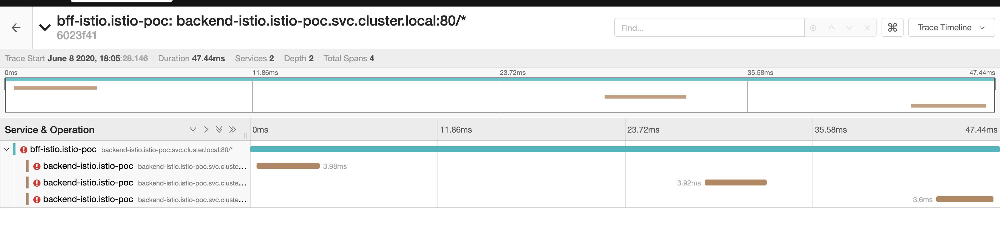
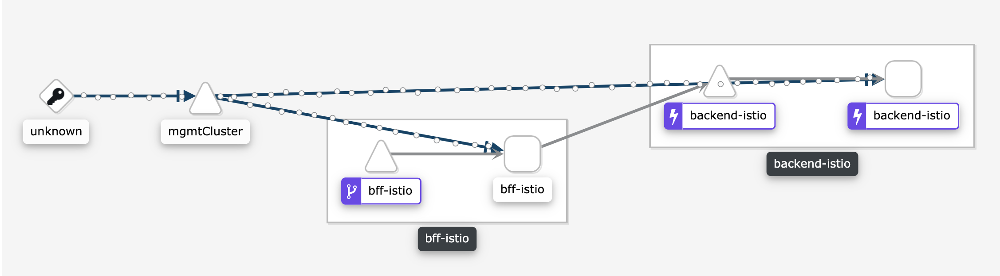
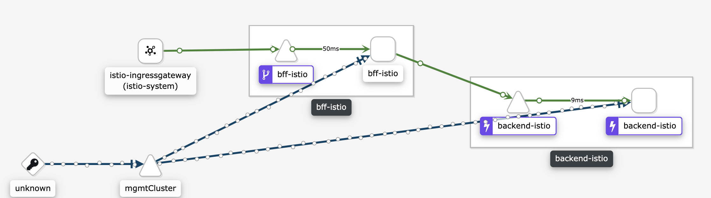
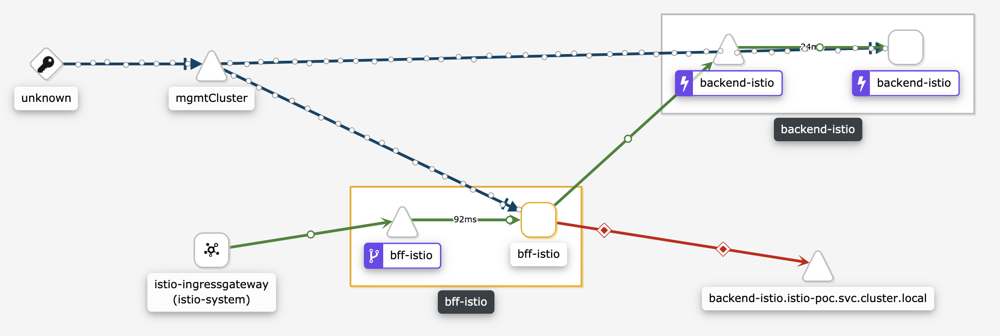

# Istio Circuit Breaker Demo

### Deploy no Minikube

#### Configuração

##### Pré Requisito
 - Conhecimentos básicos em k8s
 - Subir um cluster minikube com o istio seguindo o tutorial [disponível aqui](https://github.com/fvrodrigues/istio-environment)
 - Ter um minikube em execução

##### Trocando o deamon do docker

Para o deploy no minikube, vamos trocar nosso endereço do deamon do docker para o do minikube

````bash
eval $(minikube -p minikube docker-env)
````

##### Criando nosso namespace

````bash
kubectl create namespace istio-poc

kubectl label namespace istio-poc istio-injection=enabled

````

#### Backend

````bash
cd backend-istio && mvn clean package && docker build -t arqt-istio/backend-istio .

kubectl apply -n istio-poc -f ../k8s/backend.yaml

cd ..
````


#### BFF

````bash
cd bff-istio && mvn clean package && docker build -t arqt-istio/bff-istio .

sed s/{{CLUSTER_IP}}/$(minikube ip)/g ../k8s/bff.yaml | kubectl apply -n istio-poc -f -

cd ..
````

Para acessar o serviço do BFF e ver o roteamento, acesse: ``http://bff.apps.(CLUSTER_IP).nip.io``

__Para saber seu Cluster IP, execute no terminal o comando:__ ``minikube ip``

As URLs testadas aqui serão:

- ``http://bff.apps.(CLUSTER_IP).nip.io/api?action=success&loop=5`` - Envia 5 requisições para um endpoint que __sempre__ retorna sucesso
- ``http://bff.apps.(CLUSTER_IP).nip.io/api?action=success-slow`` - Envia uma requisição para um endpoint que __sempre__ retorna sucesso com um delay de 1s
- ``http://bff.apps.(CLUSTER_IP).nip.io/api?action=client-error`` - Envia uma requisição para um endpoint que __sempre__ retorna falha de client (4XX)
- ``http://bff.apps.(CLUSTER_IP).nip.io/api?action=server-error`` - Envia uma requisição para um endpoint que __sempre__ retorna falha de backend (5XX)


A aplicação devolve apenas um json conforme abaixo:

- ``{"message":"success"}``: Indica integração com o serviço de backend com sucesso.
- ``{"message":"slow"}``: Indica integração com o serviço de backend com sucesso com um delay.
- ``{"message":"default"}``: Indica que a integração com o serviço de backend resultou em erro 5XX.
- ``{"message":"Not Found"}``: Indica que a integração com o serviço de backend resultou em erro do cliente 4XX.

---

## Referência de resiliência

Agora que temos todos os serviços em execução, vamos explorar algumas opções do Istio

### Fault Injection

O Fault Injection do Istio possibilita simular erros nos serviços criados.

As opções de match são as mesmas disponiveis para os virtuais services, ou seja, URL, Query Param, Header, Method e Authority.

É possivel criar dois tipos de erros (status-code e delay).

###### Error Code

Injeta um HTTP Status Code.

Vamos executar:

````shell
kubectl apply -n istio-poc -f k8s/fault-injection-error.yaml
````

Para testar abra no navegador o endereço: http://bff.apps.(CLUSTER_IP).nip.io/api?action=success&loop=10

O resultado deve ser 5 itens do array com a mensagem `default`e 5 itens com a mensagens `success`

__Obs.:__ Note que o Istio leva um tempo para balancear os 50%, então podem haver mais requisições de falha ou de sucesso.

__Entendendo o que fizemos__

O arquivo que aplicamos foi o seguinte:

````yaml

apiVersion: networking.istio.io/v1alpha3
kind: VirtualService
metadata:
  name: backend-internal-route #(1)
spec:
  hosts:
  - backend-istio #(2)
  http:
  - match: #(3)
    - name: fault-to-success
      uri:
        exact: "/v1/sample/success"
    fault:
      abort: #(4)
        httpStatus: 500
        percentage:
          value: 50
    route:
      - destination:
          host: backend-istio #(5)
  - route:
    - destination:
        host: backend-istion #(6)

````


1. Nome do virtual-service

1. Host que em que o virtual-service vai ser aplicado (no caso, o service backend-istio que criamos)

1. Aplicamos o match de URI, para apenas o path ``/v1/sample/success``

1. Descrevemos a regra que queremos aplicar (caso o match seja positivo), no caso o fault injection de status code 500 (INTERNAL SERVER ERROR) para 50% das requisições

1. As requisições que fazem parte do match mas que estiverem fora dos 50%, vão ser roteadas para o service backend-istio.

1. Todas as outras requisições vão para o serviço backend-istio

###### Delay

Simula uma delay (resposta atrasada) na chamada do serviço

Vamos executar:

````shell
kubectl apply -n istio-poc -f k8s/fault-injection-delay.yaml
````

Para testar abra no navegador o endereço:  http://bff.apps.(CLUSTER_IP).nip.io/api?action=success

O resultado vai ser um tempo de resposta mais alto do que o normal mas com sucesso, indicando que o fault não interferiu na resposta, apenas aplicou o delay.

__Entendendo o que fizemos__

O arquivo que aplicamos foi o seguinte:

````yaml

apiVersion: networking.istio.io/v1alpha3
kind: VirtualService
metadata:
  name: backend-internal-route #(1)
spec:
  hosts:
  - backend-istio #(2)
  http:
  - match: #(3)
    - name: fault-to-success
      uri:
        exact: "/v1/sample/success"
    fault:
      delay: #(4)
        fixedDelay: 3s
        percentage:
          value: 100
    route:
      - destination:
          host: backend-istio #(5)
  - route:
      - destination:
          host: backend-istio #(6)

````


1. Nome do virtual-service

1. Host que em que o virtual-service vai ser aplicado (no caso, o service backend-istio que criamos)

1. Aplicamos o match de URI, para apenas o path ``/v1/sample/success``

1. Descrevemos a regra que queremos aplicar (caso o match seja positivo), no caso o delay do tempo de resposta para 100% das requisições

1. O Mesh obriga a declaração do route.

1. Todas as outras requisições vão para o serviço backend-istio

---

### Circuit Breaker

Completando as capacidades de resiliência do Istio, vamos ver o mecanismo de Circuit Breaker.

O Istio implementa as seguites capacidades de Circuit Breaker:

- Timeout
- Retry
- Fail Fast

__OBS.:__ A capacidade de Fallback não é implementada pelo istio, uma vez que requer algum nível de regras de negócio, por isso esta capacidade deve ser implementada pela aplicação, por frameworks como Resilience4J ou Hystrix

#### Timeout

Para garantir a resiliência dos serviços, devemos configurar algum nível de SLA de resposta dos serviços. Para isso, podemos utilizar o
recurso de timeout dos virtuais services, este recurso garante que o serviço deve responder dentro de um limite configurado, permitindo assim uma
constância no tempo de respostas de todo o sistema.

__Obs.:__ Este recurso requer cuidado, uma vez que irá obrigar que o serviço atenda um tempo de resposta.

Vamos executar:

````shell
kubectl apply -n istio-poc -f k8s/timeout-backend.yaml
````

Para testar abra no navegador o endereço: http://bff.apps.(CLUSTER_IP).nip.io/api?action=success-slow

O resultado obtido será sempre a mensagem `default`, porque está operação leva 1s para retornar.

__Entendendo o que fizemos__

O arquivo que aplicamos foi o seguinte:

````yaml

apiVersion: networking.istio.io/v1alpha3
kind: VirtualService
metadata:
  name: backend-internal-route #(1)
spec:
  hosts:
  - backend-istio #(2)
  http:
   - route:
      - destination:
          host: backend-istio #(3)
     timeout: 0.2s #(4)

````


1. Nome do virtual-service

1. Host que em que o virtual-service vai ser aplicado (no caso, o service backend-istio que criamos)

1. Serviço destino para nosso virtual-service

1. Timeout de 200 milesimos (0.2 segundos), ou seja, o istio vai devolver timeout caso o serviço leve mais que 0.2 segundos.


#### Retry

Alguns problemas durante a integração são temporários e podem acontecer devido uma falha de rede, ou uma perda de pacotes. Para estes cenários, uma simples retantativa pode solucionar o problema. O Istio possibilita  configurar um retry.


__Obs.:__ Os retries devem ser utilizamos com cuidado, uma vez que mal configurados podem ocasionar em retentativas em cascatas.

Vamos executar:

````shell
kubectl apply -n istio-poc -f k8s/retry.yaml
````

Para testar abra no navegador o endereço: http://bff.apps.(CLUSTER_IP).nip.io/api?action=server-error

Via dashboard do k8s você poderá ver nos logs do Backend 3 requisições, mostrando que uma requisição ao BFF resultam em 3 requisições no Backend.

Podemos também validar o comportamento via Jaeger, se você buscar os ultimo trace entre BFF e Backend verá que uma requisição ao BFF, dispararam 3 requisições ao Backend.



__Entendendo o que fizemos__

O arquivo que aplicamos foi o seguinte:

````yaml

apiVersion: networking.istio.io/v1alpha3
kind: VirtualService
metadata:
  name: backend-internal-route
spec:
  hosts:
  - backend-istio #(1)
  http:
  - match:
    - name: retry-on-slow #(2)
      method:
        exact: "GET"
    retries: #(3)
      attempts: 2
      perTryTimeout: 0.2s
      retryOn: gateway-error,connect-failure,refused-stream,5xx
    route:
      - destination:
          host: backend-istio
    timeout: 3s #(4)
  - route:
    - destination:
        host: backend-istio


````


1. Service que estamos abstraindo com o virtual service

1. Nome do match e para qual cenário ele valerá, no caso vamos fazer o retry apenas para metodos GET.

1. Politica de retry, onde caso uma requisição falhe, vamos tentar mais duas vezes (logo temos 3 requisições no total)
       Definimos um timeout de 0.2s para as retentativas, e definimos que as retentativas serão apenas para os erros de `gateway-error,connect-failure,refused-stream,5xx` (veja sobre estes erros [aqui](https://www.envoyproxy.io/docs/envoy/latest/configuration/http/http_filters/router_filter#x-envoy-retry-on))

1. Timeout total da requisição, ou seja, a requisição mais as outras duas retentativas devem obedecer esta janela de 3s.

#### Fail Fast

Este recurso é util para evitar estressar um serviço que não está com o comportamento esperado, ou que queremos evitar que saia do ar por excesso de requisições. Podemos protege-lo ou remover do pool de serviços saudaveis, uma vez que os parametros definidos forem atingidos, evitando que novas requisições cheguem a ele.

Este recurso é um dos mais complexos e podesos quando falamos de resiliência dos serviços com istio, por isso dividimos ele em dois arquivos para melhor entendimento.


__Obs.:__ Para este teste vamos utilizar uma ferramenta de benchmark, no caso caso o Apache Bench (ab), você pode encontra-lo [aqui](https://medium.com/@tiago.tartari/usando-apache-bench-para-teste-de-carga-e-an%C3%A1lise-de-performance-7dc92321de84).

__Preparação:__

Vamos excluir do nosso serviço de backend o virtual service, evitando assim qualquer comportamento do VS, além disso vamos diminuir o numero de threads do Tomcat.

````shell
kubectl delete vs backend-internal-route -n istio-poc

kubectl set env deployment/backend-istio SERVER_TOMCAT_MAXTHREADS=1 -n istio-poc

````

###### Parte 1

__Execução__

Vamos executar:

````shell
kubectl apply -n istio-poc -f k8s/destination-rule-circuit-breaker.yaml
````

Para testar:

````shell
ab -n20 -c1 -v 4 http://bff.apps.$(minikube ip).nip.io/api?action=success | grep -i message
````
Todas as requisições devolverão a mensagem success (conforme esperado para o endpoint).

Agora com concorrência

````shell
ab -n20 -c5 -v 4 http://bff.apps.$(minikube ip).nip.io/api?action=success | grep -i message
````

Algumas requisições virão com a mensagem default (a quantidade varia de acordo com o numero de conexões que o AB tentou reaproveitar).

__Entendendo o que fizemos__

````yaml
apiVersion: networking.istio.io/v1alpha3
kind: DestinationRule #(1)
metadata:
  name: backend-istio-circuit-breaker
spec:
  host: backend-istio #(2)
  trafficPolicy:
    connectionPool:
      http: #(3)
        http1MaxPendingRequests: 1
        maxRequestsPerConnection: 1

````

1. Estamos utilizando um serviço de DestinationRule, a função dele é aplicar uma determinada regra em um destino.

1. O destino que estamos aplicando é o service backend-istio

1. Aplicamos a regra de trafego, para o protocolo http, onde limitamos 1 requisição por conexão (desabilitando assim o keep-alive do HTTP), e permitimos apenas 1 requisição pendente, logo nosso serviço nunca deixará requisições aguardando (retornando neste caso como serviço indisponível 503).


###### Parte 2

__Execução__

Vamos executar:

````shell
kubectl apply -n istio-poc -f k8s/destination-rule-circuit-breaker-2.yaml
````

Para testar (visualização via Kiali):

- Acesse o Kiali > Graph e configure para atualização automatica e intervalo de 1min.

- Aguarde até ver que não existe trafego:
  

- Vamos enviar algumas requisições para mostrar que o circuito está fechado:
  ````shell
  ab -n20 -c1 -v 4 http://bff.apps.$(minikube ip).nip.io/api?action=success | grep -i message
  ````
  Devemos ver somente mensagens de sucesso e a imagem abaixo do Kiali
  

- Agora vamos enviar requisições que resultem em 502, para isso vamos aproveitar o conceito de fail fast visto na Parte 1 e aumentar a concorrência das requisições:
  ````shell
  ab -n40 -c4 -v 4 http://bff.apps.$(minikube ip).nip.io/api?action=success | grep -i message
  ````
  Veremos que algumas requisições foram com sucesso, mas em especial as ultimas foram de fallback (mensagem default).
  

- Vamos agora estressar o serviço, para que o Circuito se abra e fique um periodo aberto.
  ````shell
  ab -n500 -c8 -v 4 http://bff.apps.$(minikube ip).nip.io/api?action=success | grep -i message ; sleep 4s

  ab -n500 -c8 -v 4 http://bff.apps.$(minikube ip).nip.io/api?action=success | grep -i message ; sleep 4s

  ab -n500 -c8 -v 4 http://bff.apps.$(minikube ip).nip.io/api?action=success | grep -i message ; sleep 4s

  ab -n500 -c8 -v 4 http://bff.apps.$(minikube ip).nip.io/api?action=success | grep -i message ; sleep 4s

  ab -n500 -c8 -v 4 http://bff.apps.$(minikube ip).nip.io/api?action=success | grep -i message ; sleep 4s

  ab -n500 -c8 -v 4 http://bff.apps.$(minikube ip).nip.io/api?action=success | grep -i message ; sleep 4s

  ab -n500 -c8 -v 4 http://bff.apps.$(minikube ip).nip.io/api?action=success | grep -i message ; sleep 4s

  ab -n500 -c8 -v 4 http://bff.apps.$(minikube ip).nip.io/api?action=success | grep -i message ; sleep 4s


  ````

  __Obs.:__ Caso você veja no final destas requisições com a mensagem de sucesso, execute novamente até ver apenas as mensagens de erro (default).
  
- Vamos aguardar o kiali mostrar que acabaram o trafego.
  
- Agora podemos enviar novas requisições para mostrar que o trafego não vai mais para o Serviço.
  ````shell
  ab -n20 -c1 -v 4 http://bff.apps.$(minikube ip).nip.io/api?action=success | grep -i message
  ````
  

__Entendendo o que fizemos__

````yaml
apiVersion: networking.istio.io/v1alpha3
kind: DestinationRule
metadata:
  name: backend-istio-circuit-breaker
spec:
  host: backend-istio
  trafficPolicy:
    connectionPool:
      http: #(1)
        http1MaxPendingRequests: 1
        maxRequestsPerConnection: 1
    outlierDetection: #(2)
      consecutiveErrors: 1
      interval: 6s
      baseEjectionTime: 5m

````
1. Mantivemos as mesmas configurações anteriores (parte 1).

1. Aplicamos a regra de Circuit Breaker, com os parametros de 5s de intervalo na validação da saúde do serviço, o serviço fica com o status de "doente" (unhealth), após 1 erro consecutivo, e uma vez fora do pool, terá que aguardar no minimo 2 minutos para voltar (este tempo é incrementado de acordo com a quantidade de vezes que ele saiu  do pool).
